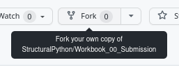

# Workbook_00_Submission
This is where your Workbook_00 submission will live.

## Instructions:

1. Create a **fork** of this repo using the "Fork" button at the top-right

2. Clone your **fork** using GitHub Desktop (like you did with Lesson_00 and Workbook_00).
3. Inside your cloned "Workbook_00_Submission" directory, create a new directory with the same as your GitHub username.
4. Inside that directory, put your completed Workbook_00.ipynb file
5. In GitHub Desktop perform a commit and 
